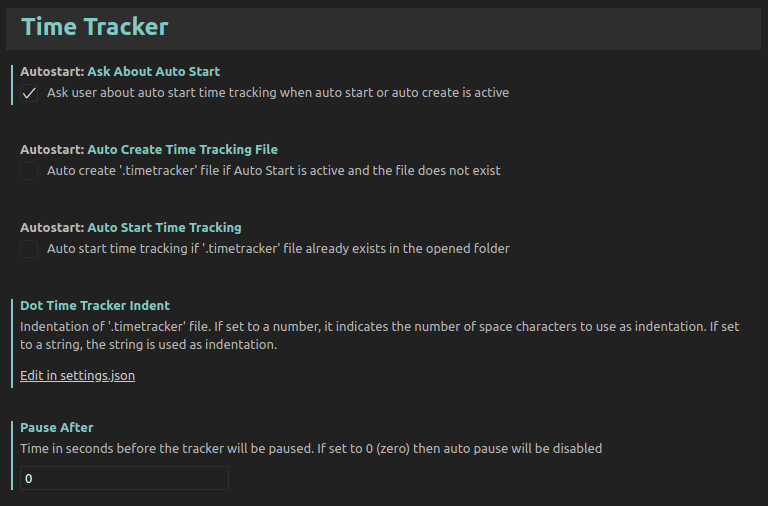

# Time Tracker
The Time Tracker extenstion will track your time spent during coding in the **Visual Studio Code**. Just start it in the beginning of your work using `Ctrl+Shift+P` and selecting `Time Tracker:Start`.

All time of activity which was spent on your work will be saved in `.timetracking` dot-file. You can push it to the GIT repo with your code to track time on all your devices.

Time Tracker will stop count the time after 2 minutes of inactivity and will move to the `Paused` state. Just begin edit code, switch editor tabs or open files and Time Tracker will resume work.

The Time Tracker visualizes its work on the status bar and displays info is described below:

* Activity states
    * `Active` - The Time Tracker is active and counting time
    * `Inactive` - The Time Tracker is stopped and is not counting time. It will not start after edtiing or openning file
    * `Paused` - The Time Tracker is paused and is not counting time but will start just with beginning of your activity.
* Total time is spent on the project
* Current session time: The time since the last pause or since `Time tracking:Start` performing.

## Commands

Use `Ctrl+Shift+P` to execute Time Tracker commands.
* `Time Tracker: Start` - Activate time tracking
* `Time Tracker: Pause` - Pause time tracking
* `Time Tracker: Stop` - Deactivate time tracking

## Configuration

At the moment the configuration provides options described below:
* `timetracker.autostart.autoStartTimeTracking` - Automatically start time tracking when the project (folder) is opened and `.timetracking` file already exists in the project's folder
* `timetracker.autostart.autoCreateTimeTrackingFile` - Automatically start time tracking and create `.timetracking` file if it does not exist yet
* `timetracker.autostart.askAboutAutoStart` - Ask user before automatically start time tracking

Also you can setup these options via `File` -> `Preferences` -> `Settings`

