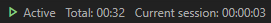

# **Time Tracker**
The Time Tracker extenstion will track your time spent during coding in the **Visual Studio Code**. Just start it in the beginning of your work using `Ctrl+Shift+P` and selecting `Time Tracker:Start`.

All time of activity which was spent on your work will be saved in `.timetracking` dot-file. You can push it to the GIT repo with your code to track time on all your devices.

Time Tracker will stop count the time after 2 minutes of inactivity and will move to the `Paused` state. Just begin edit code, switch editor tabs or open files and Time Tracker will resume work.

Time of inactivity can be changed in settings (see below).

## **Appearance variants**

The Time Tracker visualizes its work on the status bar. There are two modes awailable for choosing.

#### **Wide mode**
In this mode the status panel looks like shown on the picture below:

Wide mode provides the following information:

* Activity states
    * `Active` - The Time Tracker is active and counting time
    * `Inactive` - The Time Tracker is stopped and is not counting time. It will not start after editing or opening file
    * `Paused` - The Time Tracker is paused and is not counting time but will start just with beginning of your activity.
* Total time is spent on the project
* Current session time: The time since the last pause or since `Time tracking:Start` performing.

### **Compact mode**

If you prefer more compact interface you can enable `Use Compact Panel` in settings. In this case the status panel will look like shown below:

In this mode the active state is indicated by a small watches icon. The pause mode is also indicated by the icon, but in the stop mode no icon is displayed.

## **Activation / Deactivation**

#### **Using the mouse**
Just click on the status panel to start counting and click one more time to stop.

#### **Using commands**

Use `Ctrl+Shift+P` to execute Time Tracker commands.
* `Time Tracker: Start` - Activate time tracking
* `Time Tracker: Pause` - Pause time tracking
* `Time Tracker: Stop` - Deactivate time tracking

## **Configuration**

At the moment the configuration provides options described below:

**Startup behavior configuration:**

* `timetracker.autostart.autoStartTimeTracking` - Automatically start time tracking when the project (folder) is opened and `.timetracking` file already exists in the project's folder
* `timetracker.autostart.autoCreateTimeTrackingFile` - Automatically start time tracking and create `.timetracking` file if it does not exist yet
* `timetracker.autostart.askAboutAutoStart` - Ask user before automatically start time tracking

**Auto-pause behavior**
* `timetracker.pauseAfter` - Time in seconds before the tracker will be paused. If set to 0 (zero) then auto pause will be disabled

**Appearance**
* `timetracker.useCompactStatusPanel` - Use compact mode of the status bar. The default is false.
* `timetracker.dotTimeTrackerIndent` - Indentation of '.timetracker' file. If set to a number, it indicates the number of space characters to use as indentation. If set to a string, the string is used as indentation

Also you can setup these options via `File` -> `Preferences` -> `Settings`

